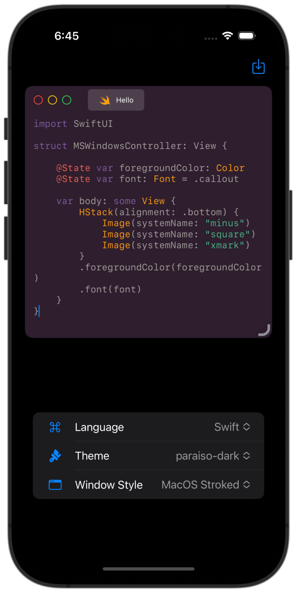
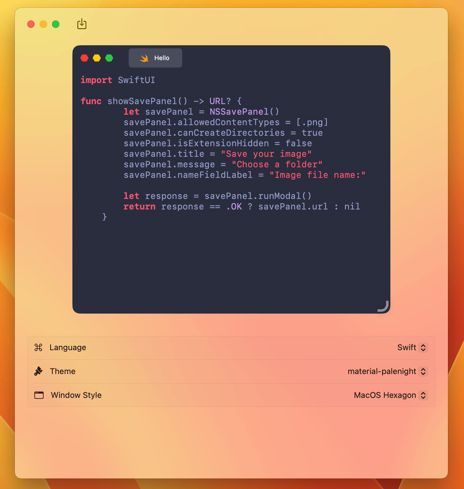

  
  <h1 align="center">Tricks Code Highlighter</h1>

Are you familiar with [carbon.now.sh](https://carbon.now.sh)? This application is something similar, You can convert your code to a beautiful windowed image with highlighting feature. Also this application is using [Highlighter](https://github.com/Rminsh/highlighter) library as it's core. With the power of SwiftUI you can run the same code both on iOS and macOS.

### Preview 🌠

### Donation ✌🏻

### License 📝

Licensed under the [GNU GENERAL PUBLIC LICENSE Version 3](./LICENSE.md).
